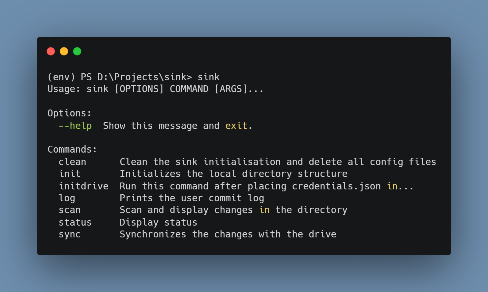

# Sink

Sink is a CLI synchronisation tool that enables a user to synchronise 
local system files and folders onto their Google Drives. It follows
a git CLI like approach in terms of interface 

## Installation

Install sink with pip

Extract the `drive-sink` folder to a suitable directory and run the following
commands in that folder. (It is advised to install in a virutal environment)

```bash
  pip install .
  cd drive-sink-main
```

Run the command `sink` from the environment to use the tool.




## Script Setup

In case of a virtual environment, one might use the script inside `scripts` folder by replacing the path inside the `sink.bat` with the path of `sink.exe` inside your env/scripts. And then add this script to your environment variables.


Assuming the path of env/scripts is : `D:\Projects\trial\env\Scripts\sink.exe`

```batch
@echo off

:: Replace the <path> with the absolute path of your env/scripts folder
:startsink  
D:\Projects\trial\env\Scripts\sink.exe %*
```

(NOTE: Above is applicable for windows only. Linux and Mac users need to create separate scripts)


## Google Drive API Setup

As the application is based on the Google Drive API, in order to use it, you need to activate the Google Drive API for your account. Following are the steps to do so :

[Enable Drive API for your account](https://developers.google.com/drive/api/v3/enable-drive-api)

After enabling the Drive API, you need to generate credentials for your account, the following article explains the steps to generate the credentials for your account.

[Generate credentials for your account](https://support.google.com/cloud/answer/6158849?hl=en)

After generating the credentials, download the `.json` file with credentials and rename it to `credentials.json` and paste it in the config folder 'after' initialising a directory.

## Documentation

You can type in `sink` in your terminal or `sink --help` to see all the available commands available.
* `sink init` : Initialise the folder and config details
* `sink initdrive` : Verify credentials and sync files to drive
* `sink scan` : Scans the directory for changes in files and folders
* `sink sync` : Updates/commits the changes to the drive
* `sink log` : Shows the commit log
* `sink status` : Shows general config information
* `sink clean` : Cleans (untracks) the given folder with option to delete drive folder as well

For further options for each command, type `sink <command-name> --help`


## Usage

1. In order to initialise a directory for synchronisation, we need to use the command `sink init`
2. Then we paste the `credentials.json` file generated by Google inside the config folder in .sink. 
3. Then run `sink initdrive` to verify your credentials and initialise the directory on your drive.
4. You can list the files that need to be ignored in the `ignore.txt` inside the .sink folder
5. For just scanning the changes in the directory, we use `sink scan`
6. For syncing/commiting the changes to drive, we use the command `sink sync`. We can also the `-m` option along with `sink sync` to log a commit message.
7. To view commit messages, we can use the command `sink log`. Sink log can take in number of lines as an option (defalut = 5).
8. `sink status` can be used to see te config details for the current directory
    
## License

[MIT](https://choosealicense.com/licenses/mit/)

  

